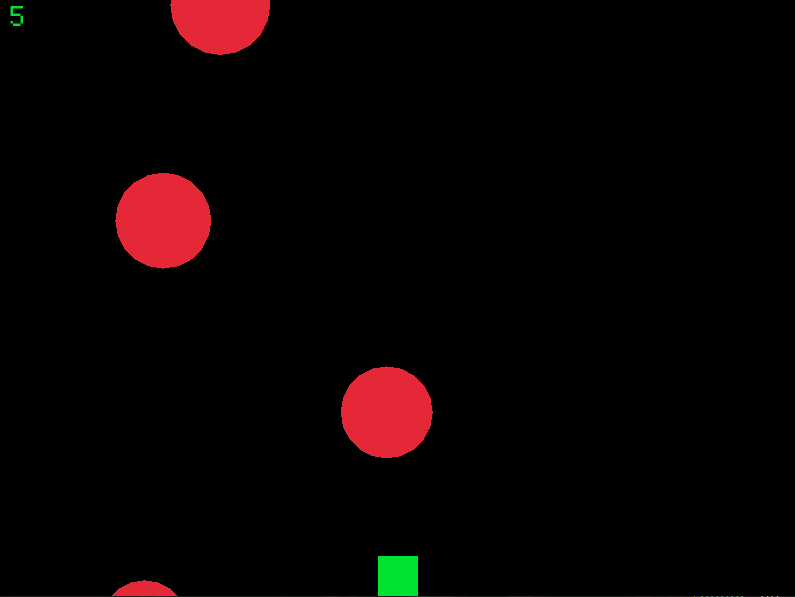
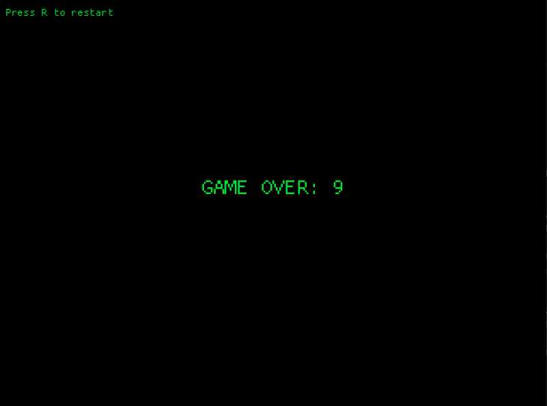

# Dodger Game

A simple 2D dodger game built in **Rust** using **Macroquad**. The player controls a square to avoid falling circles and earn points.

---

## Features

- Smooth player movement with acceleration and friction.
- Randomly falling circles with increasing difficulty.
- Score tracking for circles avoided.

---

## Tech Stack

- Rust
- Macroquad

---

## Screenshots

**Gameplay:**  

**Game Over:**  

---
